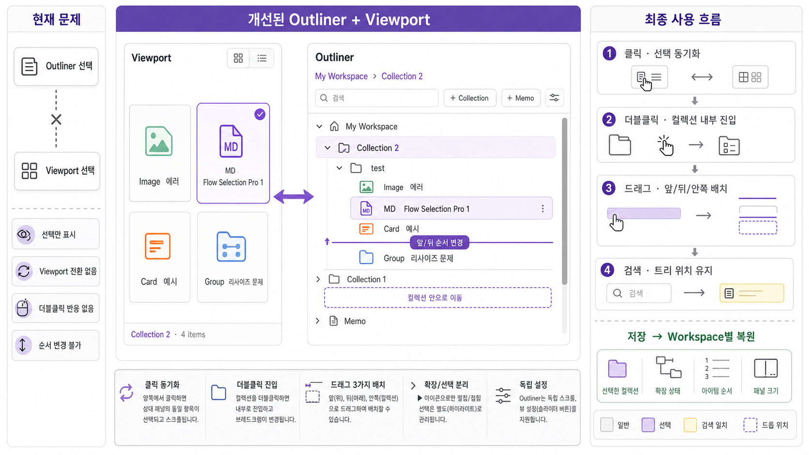

# Canvas Palette Outliner UX 재설계



## 1. 무엇이 수정되는가

현재 Outliner는 항목을 나열하고 선택 색상을 표시하는 수준에 머물러 있다. 이를 다음 세 역할이 연결된 자료 구조 편집기로 바꾼다.

1. **Collection 구조 편집기**: 생성, 중첩, 펼침·접힘, 순서 변경, 소속 변경
2. **Viewport Navigator**: 어느 쪽에서 선택해도 반대쪽의 같은 자료를 선택하고 화면 중앙으로 이동
3. **현재 작업 위치 선택기**: Collection을 선택하거나 내부로 들어가면 Viewport가 그 위치의 자료만 표시

## 2. 전체 화면 구조

```text
┌──────────────────────── Viewport ────────────────────────┬──────────────────── Outliner ────────────────────┐
│ Collection 2 · 4 items                                   │ My Workspace  ›  Collection 2                    │
│                                                          │ [검색........................] [+ Collection] [+ Memo] [설정] │
│ ┌──────────┐ ┌──────────┐                               │ ▾ My Workspace                                    │
│ │ Image    │ │ MD       │ ← 선택                        │   ▾ Collection 2                    ← 선택          │
│ │ 에러     │ │ Flow...  │◀──────── 선택 동기화 ───────▶│     ▾ test                                         │
│ └──────────┘ └──────────┘                               │       Image  에러                                  │
│ ┌──────────┐ ┌──────────┐                               │       MD     Flow Selection Pro 1   ← 선택          │
│ │ Card     │ │ Group    │                               │       Card   예시                                  │
│ │ 예시     │ │ 리사이즈 │                               │       Group  리사이즈 문제                         │
│ └──────────┘ └──────────┘                               │                                                    │
└──────────────────────────────────────────────────────────┴────────────────────────────────────────────────────┘
```

## 3. Outliner 헤더

| UI | 역할 |
|---|---|
| `My Workspace › Collection 2` | 현재 들어와 있는 Collection 경로. 상위 이름을 누르면 즉시 이동 |
| 검색 | Tree는 유지하고 일치 항목을 강조. 일치 항목의 닫힌 부모는 검색 중에 임시로 펼침 |
| `+ Collection` | 현재 위치 아래에 Collection 생성 |
| `+ Memo` | 현재 위치에 Memo 생성 |
| 보기 설정 | Item 높이와 글자 크기 조절 |

## 4. Collection UI

Collection 한 행은 다음 순서로 구성한다.

```text
[펼침 화살표] [폴더 아이콘] [Collection 이름] [항목 수]         [+] [이름 변경]
```

- **화살표 클릭**: 펼침·접힘만 변경한다. Collection 선택은 바꾸지 않는다.
- **행 한 번 클릭**: 현재 Collection으로 선택하고 Viewport 내용을 전환한다.
- **행 더블클릭**: 해당 Collection 내부로 들어가고 Breadcrumb를 갱신한다.
- **상위 Breadcrumb 클릭**: 상위 Collection 또는 Workspace 루트로 돌아간다.
- **선택 표시**: 옅은 Accent 배경과 왼쪽 3px Accent 막대를 함께 사용한다.
- **현재 진입 위치**: 선택 표시와 별도로 폴더 아이콘 및 굵은 제목으로 구분한다.

선택과 펼침 상태는 서로 독립적이어야 한다. Collection을 선택했다고 자동으로 접거나 펼치지 않는다.

## 5. 항목 UI

```text
[타입 아이콘] [제목................................] [연결 상태] [더보기]
```

| 타입 | 아이콘·색상 |
|---|---|
| Card | 문서 카드, 주황색 |
| Markdown | `MD` 문서, 보라색 |
| Image | 이미지, 초록색 |
| Group | 노드 묶음, 파란색 |

- 제목은 한 줄을 기본으로 하되 좁은 패널에서는 두 줄까지 허용한다.
- `CARD`, `MARKDOWN`, `IMAGE`, `GROUP` 같은 긴 타입 문자열을 행 앞에 반복하지 않는다.
- 연결된 Canvas가 없으면 기존 Unlinked 상태 아이콘을 제목 뒤에 표시한다.
- 검색 일치는 노란색 테두리 또는 텍스트 배경으로 표시하며 선택 보라색과 혼동되지 않게 한다.

## 6. Viewport와 선택 동기화

### Outliner에서 항목을 누를 때

```text
Outliner 항목 클릭
→ 기존 단일 선택 해제
→ 같은 항목을 Outliner와 Viewport에서 동시에 선택
→ Viewport에 보이지 않으면 해당 카드가 중앙에 오도록 자동 스크롤
```

### Viewport에서 카드를 누를 때

```text
Viewport 카드 클릭
→ 같은 항목을 Outliner에서 선택
→ 닫힌 부모 Collection이 있으면 경로를 자동으로 펼침
→ Outliner 항목이 보이지 않으면 중앙으로 자동 스크롤
```

### 다중 선택

- 일반 클릭: 하나만 선택
- `Ctrl/Cmd + 클릭`: 항목 추가·해제
- `Shift + 클릭`: 현재 보이는 순서를 기준으로 연속 범위 선택
- 두 패널의 선택 개수와 선택 항목은 항상 같아야 한다.
- Collection을 선택하면 항목 다중 선택은 해제한다.

## 7. Collection 선택과 Viewport 전환

| 선택 대상 | Viewport 결과 |
|---|---|
| Workspace 루트 | 루트에 직접 놓인 항목 표시 |
| Collection | 그 Collection에 직접 속한 항목 표시 |
| 하위 항목 포함 옵션 켜기 | 선택 Collection과 모든 하위 Collection 항목 표시 |
| 검색 중 | 선택된 범위 안에서 검색 결과만 표시 |

기본값은 **현재 Collection에 직접 속한 항목만 표시**다. 하위 Collection까지 한꺼번에 보고 싶을 때만 보기 설정에서 `하위 항목 포함`을 켠다.

## 8. Drag & Drop 설계

드래그 위치는 세 가지로 명확하게 분리한다.

### 앞에 배치

```text
──────────────  ← 위쪽 삽입선
대상 항목
```

대상 행의 위쪽 25%에 놓으면 그 항목 앞에 배치한다.

### 뒤에 배치

```text
대상 항목
──────────────  ← 아래쪽 삽입선
```

대상 행의 아래쪽 25%에 놓으면 그 항목 뒤에 배치한다.

### Collection 안에 배치

```text
╔════════════════ Collection ════════════════╗
║              안으로 이동                  ║
╚════════════════════════════════════════════╝
```

Collection 행의 가운데 50%에 놓으면 그 Collection의 마지막 항목으로 이동한다.

추가 규칙:

- 선택된 항목 하나를 끌면 선택된 전체 항목을 함께 이동한다.
- 여러 항목의 상대적 순서는 유지한다.
- 자기 자신이나 자신의 하위 Collection 안으로는 이동할 수 없다.
- 불가능한 위치에서는 금지 커서와 설명을 표시한다.
- 드래그 중 자동 스크롤은 Outliner 위·아래 가장자리에서만 작동한다.
- 실제 저장은 Drop이 끝난 한 번만 수행한다.

## 9. 펼침·검색·스크롤

- Outliner는 Viewport와 분리된 자체 스크롤을 유지한다.
- 검색을 시작해도 전체 Collection Tree는 사라지지 않는다.
- 검색 일치 항목의 부모 경로는 임시로 펼치고, 검색을 지우면 사용자가 저장한 펼침 상태로 돌아간다.
- 현재 선택 항목은 검색 결과에서 제외되면 선택을 해제하고 이유를 상태줄에 표시한다.
- `Escape`는 검색어를 지우고, 다시 누르면 현재 Collection 선택은 유지한 채 항목 선택만 해제한다.

## 10. 보기 설정

```text
Outliner 보기 설정
├─ Item 높이        [작게 ─────●───── 크게]
├─ 글자 크기        [작게 ───●────── 크게]
├─ 하위 항목 포함   [끔/켬]
└─ 긴 제목          [한 줄 / 두 줄]
```

- 설정창은 Outliner 헤더 아래에 작게 펼쳐진다.
- Viewport 설정과 섞지 않는다.
- Light/Dark 테마에서 같은 배치와 크기를 유지한다.

## 11. Workspace별 저장

다음 상태를 Workspace별로 저장하고 다시 열었을 때 복원한다.

- 현재 선택된 Collection
- Breadcrumb 경로
- 펼쳐진 Collection 목록
- Collection 및 항목 순서
- Outliner Item 높이와 글자 크기
- `하위 항목 포함` 여부
- Outliner 스크롤 위치
- Viewport와 Outliner의 패널 비율

항목 선택은 일시적인 작업 상태이므로 플러그인 재시작 후에는 복원하지 않는다.

## 12. 업데이트 전후

| 현재 | 수정 후 |
|---|---|
| Collection 클릭 시 색상만 변경 | Collection 선택과 동시에 Viewport 내용 전환 |
| 더블클릭 반응 없음 | 내부 진입 및 Breadcrumb 변경 |
| Outliner와 Viewport가 서로 다른 항목을 동시에 선택 | 항상 하나의 공유 선택 상태 사용 |
| 반대 패널로 자동 이동하지 않음 | 선택 항목을 양쪽에서 중앙으로 자동 스크롤 |
| 모든 Collection이 항상 펼쳐짐 | 화살표로 펼침·접힘 |
| 항목을 다른 Collection으로만 이동 | 앞·뒤 순서 변경과 Collection 안쪽 이동 지원 |
| 타입을 긴 영문 글자로 표시 | 구분되는 타입 아이콘 사용 |
| Outliner 전용 보기 설정 없음 | Item 높이·글자 크기·하위 항목 옵션 제공 |

## 13. 최종 사용 흐름

```text
Workspace 열기
→ 이전 Collection 경로와 Tree 상태 복원
→ Collection 클릭
→ Viewport가 해당 자료로 전환
→ Outliner 또는 Viewport에서 항목 선택
→ 반대 패널의 동일 항목 선택·자동 스크롤
→ 필요하면 여러 항목 선택
→ 삽입선 또는 Collection 안쪽에 드롭
→ 구조와 순서 저장
```

## 14. 완료 판단 기준

- Collection 클릭만으로 Viewport 결과가 정확히 바뀐다.
- Collection 더블클릭 후 Breadcrumb와 현재 위치가 정확히 바뀐다.
- Outliner와 Viewport가 서로 다른 항목을 동시에 선택한 상태가 발생하지 않는다.
- 양쪽 방향 모두 선택 항목까지 자동 스크롤한다.
- 펼침 화살표가 선택을 바꾸지 않는다.
- 앞·뒤·안쪽 Drop이 시각적으로 구분되고 실제 저장 결과와 일치한다.
- 여러 항목 이동 시 빠지거나 중복되는 항목이 없다.
- 검색을 지우면 기존 펼침 상태가 복원된다.
- Workspace를 다시 열면 구조·순서·설정·패널 비율이 복원된다.
- 원본 Markdown/Image 파일과 Canvas 연결 정보는 이동·정렬 과정에서 변하지 않는다.
