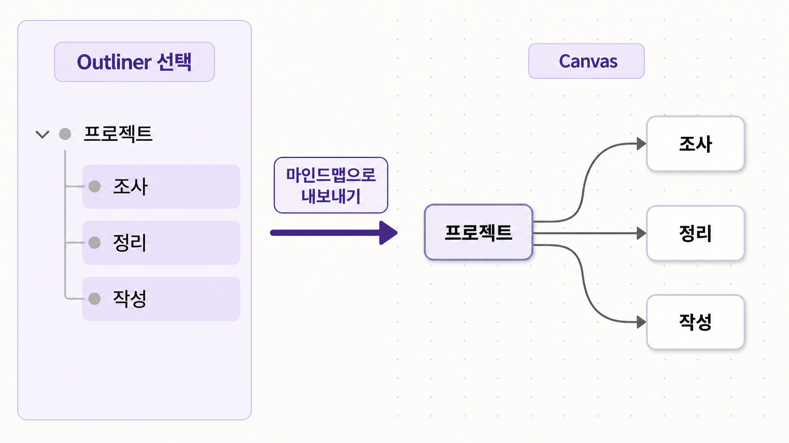
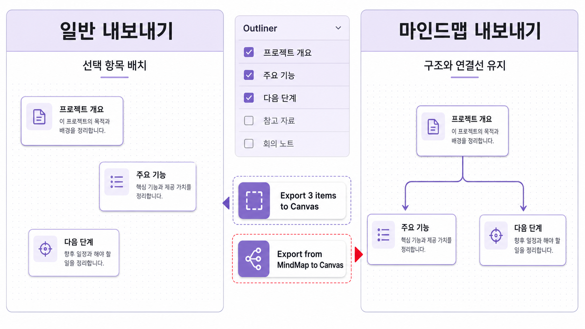
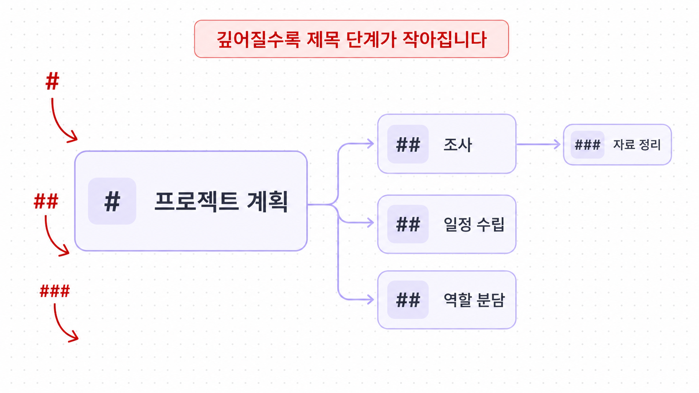

# 강의 대본: Outliner를 Canvas 마인드맵으로 내보내기

> 이 자료는 첨부된 화면 시안을 바탕으로 한 **기능 설명용 강의 대본**입니다. 아직 구현·배포 완료를 뜻하지 않습니다.

## 1. 시작: 이번 기능이 해결하는 문제

안녕하세요. 이번 시간에는 Canvas Palette의 Outliner에 정리해 둔 구조를, Canvas에서 바로 읽을 수 있는 마인드맵으로 바꾸는 흐름을 살펴보겠습니다.

Outliner에는 보통 부모 항목과 그 아래의 하위 항목이 차례로 정리되어 있습니다. 지금까지는 선택한 항목을 Canvas에 배치할 수 있었지만, 항목 사이의 **부모·자식 관계**가 언제나 한눈에 보이는 방식으로 표현되는 것은 아니었습니다.

새 마인드맵 내보내기는 이 구조를 읽습니다. 부모 항목은 중심 노드가 되고, 자식 항목은 연결선을 따라 옆으로 펼쳐집니다. 따라서 Canvas를 열었을 때 무엇이 어떤 주제 아래에 속하는지 바로 파악할 수 있습니다.



## 2. 화면에서 달라지는 점

사용자는 기존 기능을 잃지 않습니다. 일반 내보내기와 마인드맵 내보내기는 목적이 다르므로, 화면에서도 구분해서 선택합니다.

- **일반 내보내기**는 선택한 항목들을 Canvas에 배치할 때 사용합니다.
- **마인드맵 내보내기**는 선택한 항목과 Collection의 계층 구조, 그리고 부모·자식 연결선을 함께 가져올 때 사용합니다.

선택 항목 메뉴에는 `Export from MindMap to Canvas`가 추가됩니다. Collection 메뉴의 기존 `Export collection to Canvas`는 같은 마인드맵 흐름으로 연결됩니다. 반면 `Export N items to Canvas`는 그대로 남아, 구조를 만들 필요 없는 일반 배치에 계속 사용합니다.



## 3. 실제 사용 흐름

이제 사용 순서를 보겠습니다.

1. Outliner에서 내보낼 항목 또는 Collection을 선택합니다.
2. 구조를 유지해 Canvas로 옮기려면 `Export from MindMap to Canvas`를 누릅니다.
3. Collection 전체를 옮길 때는 해당 Collection의 `Export collection to Canvas`를 누릅니다.
4. 대상 Canvas를 고르고, 배치 미리보기를 확인합니다.
5. 겹치지 않는 위치를 클릭하면 마인드맵이 한 번에 배치됩니다.

이 과정의 핵심은 단순히 카드 여러 장을 놓는 것이 아닙니다. Outliner에서 보던 들여쓰기와 관계가 Canvas의 노드와 연결선으로 이어지는 것이 핵심입니다.

## 4. 제목 단계와 계층 읽기

마인드맵에서는 깊이가 깊어질수록 제목 단계도 한 단계씩 작아집니다.

- 가장 바깥 주제는 `#`
- 그 아래 하위 주제는 `##`
- 한 단계 더 내려간 세부 항목은 `###`

이 규칙을 적용하면, 노드의 크기와 제목 단계만 봐도 어느 항목이 중심 주제이고 어느 항목이 세부 내용인지 이해할 수 있습니다.



## 5. 마무리

정리하면, 일반 내보내기는 **선택한 자료를 Canvas에 놓는 기능**이고, 마인드맵 내보내기는 **Outliner의 생각 구조를 Canvas에서 다시 읽을 수 있게 만드는 기능**입니다.

```text
Outliner에서 구조 선택
        ↓
마인드맵 내보내기 선택
        ↓
부모 노드와 자식 노드 생성
        ↓
연결선과 제목 단계로 관계 표현
        ↓
Canvas에서 전체 흐름 파악
```

다만 서로 다른 위치의 항목과 Collection을 여러 개 동시에 선택했을 때, 각각을 독립 마인드맵으로 만들지 또는 하나의 공통 루트 아래에 묶을지는 별도 동작 정의가 필요합니다.
